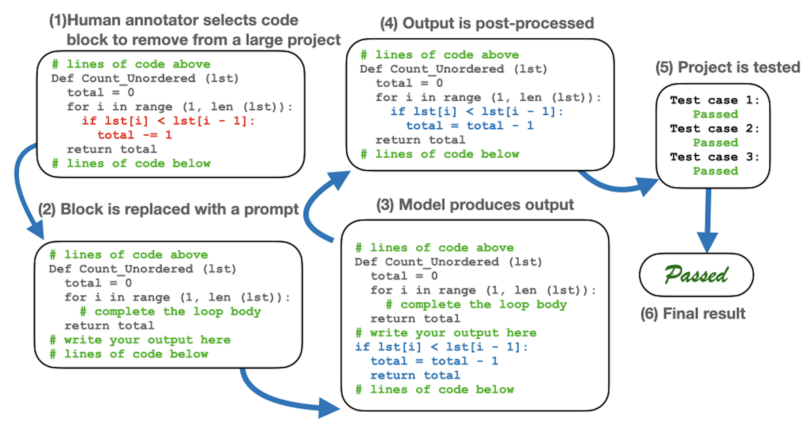
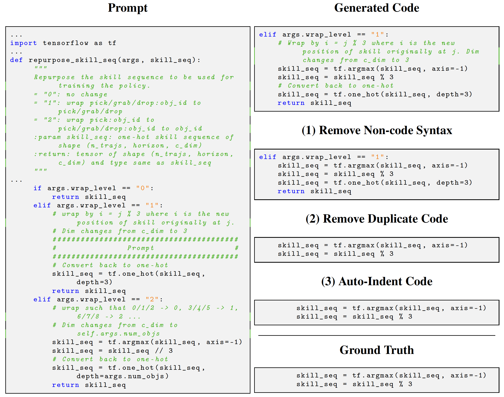
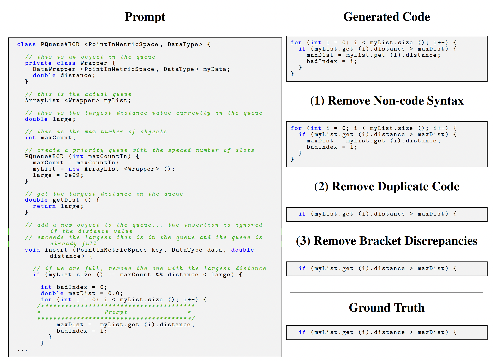
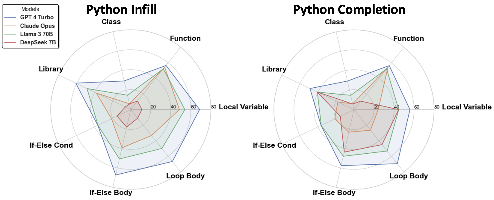
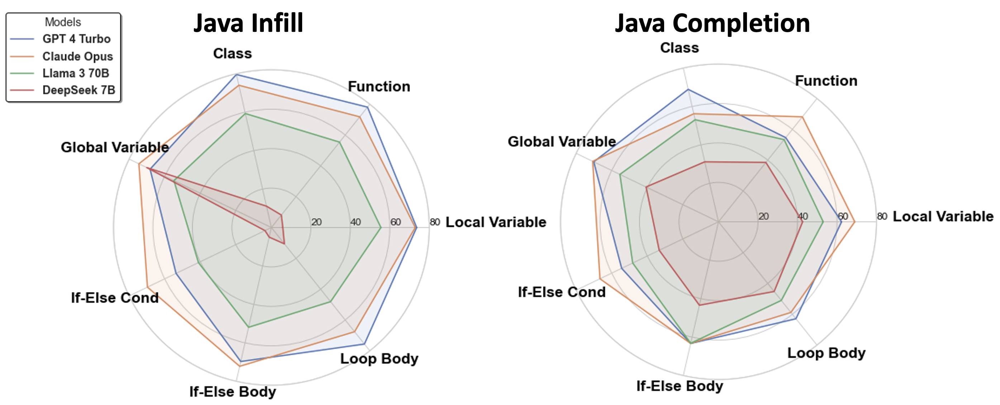
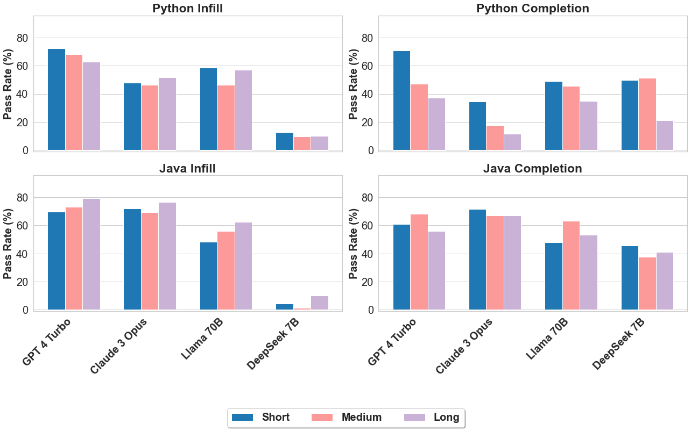
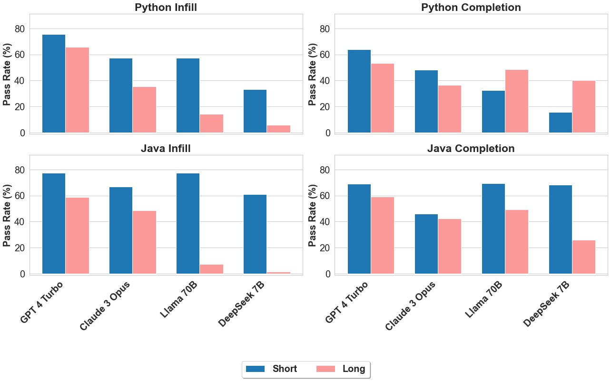

# SimCoPilot: Evaluating Models for Co-pilot-Style Code Generation
**SimCoPilot** is a benchmark with:
- **Purpose**: Evaluate LLMs as interactive coding assistants in "copilot"-style.
- **Focus**: Test AI's ability to integrate and complete code in complex software environments.


🤔*Question: Can an AI tool correctly complete code snippets like `method body`, `if-statements`, or `for-loops` from real-world projects?*


<p align="center">
  <br>
  <em>SimCoPilot Demo</em>
</p>


**Why SimCoPilot?**
- **Real-World Complexity**: Tests AI on complex, real-project tasks, not just concise and standalone programs.
- **Real-Code Understanding**: Focuses on AI's ability to work with actual code, without needing manually annotated problem descriptions to prompt for each task.
- **Fine-grained Results**: Stratifies results according to metrics such as distance to the nearest referenced object, proximity to the nearest comment, and various programming constructs.

## 📊 Dataset


The data for this project can be found in the ` dataset/SimCoPilot.csv.zip` file. 

**Hosting, Licensing, and Maintenance Plan.**
- **Dataset and Metadata Access.** The dataset and its associated metadata, documented using the Croissant metadata framework, can be viewed and downloaded at [Huggingface Datasets:SimCoPilot](https://huggingface.co/datasets/mj33/SimCoPilot).
The data nutrition label can be found at [Data Nutrition Label](https://github.com/mj33rice/SimCoPilot/tree/main/dataset#data-nutrition-label).
- **Licensing:** The data is shared under the [CC BY-NC-ND 4.0](https://creativecommons.org/licenses/by-nc-nd/4.0/) and code is licensed under MIT License.
- **Maintenance Plan:** We commit to maintaining the dataset with regular updates and revisions to correct any issues and integrate new contributions. Updates will be documented in the repository's release notes section.
## 🏆 LeaderBoard


| Model            | Python Infill | Python Completion | Java Infill | Java Completion | HumEval | MBPP |
|------------------|---------------|-------------------|-------------|-----------------|---------|------|
| GPT 4 Turbo      | **68.3±4.6**  | **55.6±6.6**      | **74.9±5.0**| 61.5±5.6        | **86.6**| **73.3**|
| Claude 3 Opus    | 48.4±5.0      | 24.0±5.8          | 73.4±5.1    | **68.1±5.3**    | 77.4    | **73.3**|
| LLaMA 3 70B      | 54.4±5.0      | 45.2±6.6          | 56.1±5.8    | 53.7±5.7        | 72.0    | 69.0 |
| Claude 3 Sonnet  | 48.4±5.0      | 26.8±5.9          | 57.9±5.7    | 55.6±5.7        | 64.0    | 69.3 |
| Claude 3 Haiku   | 34.5±4.7      | 27.3±5.9          | 31.1±5.3    | 48.9±5.7        | 68.9    | 68.8 |
| GPT 3.5 Turbo    | 35.6±4.8      | 52.8±6.6          | 26.0±5.0    | 42.6±5.7        | 70.7    | 69.7 |
| LLaMA 3 8B       | 27.7±4.4      | 31.5±6.2          | 23.6±4.8    | 26.9±5.1        | 56.7    | 59.3 |
| DeepSeek 7B      | 11.2±3.1      | 45.3±6.6          | 5.6±2.7     | 41.9±5.7        | 71.3    | 62.2 |
| DeepSeek 1.3B    | 8.1±2.7       | 12.2±4.3          | 5.6±2.7     | 16.0±4.2        | 60.4    | 54.8 |
| Phi-3(4k) 3.8B   | 5.2±2.2       | 8.0±3.7           | 7.7±5.8     | 10.4±3.5        | 59.1    | 54.2 |

<!-- When controllable and applicable, the randomness of the AI-for-code model is "turned off" so that the most likely/preferred answer is produced.
All results in the SIMCOPILOT benchmark are presented with 95% confidence intervals. -->
> **Note**: To ensure consistency, the AI-for-code model's randomness is minimized, aiming for the most likely/preferred outcomes. All SIMCOPILOT benchmark results are reported with 95% confidence intervals.
## 🚀 Getting Started

1. Clone the repository.
2. Install necessary dependencies.
3. Run the analysis on your target codebase by specifying the file path and dependency range parameters.

To install the Dependency Analyzer, clone this repository and run the setup script:

```bash
git clone https://github.com/mj33rice/SimCoPilot.git
pip install -r requirements.txt
```

<details>
<summary><b>OpenAI & Anthropic Models Setup</b></summary>
1. Install the necessary Python packages:

```bash
pip install anthropic
```
2. Open your terminal and type the following command:
```bash
nano ~/.bash_profile 
```
If you’re using a newer version of macOS, you might need to use `~/.zshrc` instead:
(or nano ~/.zshrc if you’re using a newer version of macOS)
```bash
nano ~/.zshrc
```
3. Add the following line to the file, replacing `your-api-key-here` with your actual API key:
```bash
 export ANTHROPIC_API_KEY='your-api-key-here' 
```
 If you're using OpenAI, use this line instead:
```bash
 export OPENAI_API_KEY='your-api-key-here'
```
4. Save the file and exit the editor (press `Ctrl+O`, then `Enter`, then `Ctrl+X`)
5. Load the updated profile by running: 

```bash
source ~/.bash_profile (or source ~/.zshrc)
```
</details> 


## 🏃How to Run

### Code Generation 

The commands below enable code generation model execution on Java and Python files for both closed-source and open-source models. Specify source code paths, test cases, the model, and the code generation mode as follows:

### Closed Source Models
```python
python close_source_model_gen.py <source_code_path> <test_cases_path> --gen_model <model_name> --code_gen_mode <mode>
```

- `source_code_path`: Path to the Python or Java source code file. 
- `test_cases_path`: Path to the JSON test cases file.
- `--gen_model`: Close source model for code generation, e.g.`gpt-4-turbo`, `claude-3-opus-20240229`.
- `--code_gen_mode`: Specifies the code generation task type:
    - `with_afterlines`: For infilling tasks with context before and after the target code.
    - `no_afterlines`: For completion tasks, generating code to finish a block without subsequent context.
### Open Source Models
```python
CUDA_VISIBLE_DEVICES=$gpu_id python -m open_source_model_gen.open_source_code_gen <source_code_path> <test_cases_path> --gen_model <model_name> --code_gen_mode <mode>
```
- `$gpu_id`: Specifies the ID of the GPU to use for the code generation.
- `--gen_model`: Close source model for code generation, e.g.`deepseek-coder-1.3b-instruct`.

<details>
<summary><b>Example Command</b></summary>

Code generation script with specific parameters, you can use the following command:
This command specifies the use of the `gpt-4-turbo`models for code generation with the mode set to `with_afterlines` indicating that the generation should consider both the preceding and following context.
```python
#Close Source Models
python close_source_model_gen.py \
./example_code/Python/simplex_method/simplex_method.py \
./example_code/Python/simplex_method/simplex_method.json \
--read_dependency_results --update_def_line \
--gen_model gpt-4-turbo \
--code_gen_mode with_afterlines
```
This command specifies the use of the `deepseek-coder-1.3b-instruct` models for code generation with the mode set to `no_afterlines`, indicating that the generation should only consider both the preceding context.
```python
#Open Source Models
CUDA_VISIBLE_DEVICES=0 python -m open_source_model_gen.open_source_code_gen \
./example_code/Java/COMP215/A0/Test/FactorizationTester.java \
./example_code/Java/COMP215/A0/Test/FactorizationTester.json \
--read_dependency_results --update_def_line \
--gen_model deepseek-coder-1.3b-instruct \
--code_gen_mode no_afterlines
```
</details>

<details>
<summary><b>Run from the Script</b></summary>

```bash
#For Python tasks
chmod +x run_python_paral.sh
./run_python_paral.sh

#For Java tasks
chmod +x run_java_paral.sh
./run_java_paral.sh
```
</details>

## 🛠 Post Processing 
```python
python -m helper_functions.update_post_process_and_eval ./PATH/to/result_folder
```

#### Example of Post-Processing

For detailed examples of code Post-Processing, please refer to the figure below:



*Figure 2: Example infill task from SimCoPilotP and step-by-step post-processing demonstration.*



*Figure 3: Example completion task from SimCoPilotJ and step-by-step post-processing demonstration*

## 🔍 Stratified Evaluation
Detailed results comparing the test case pass ratios of various LLMs:  
- Categorized by models and different programming constructs: [code](helper_functions/code_gen_result_display.ipynb)


<table>
  <tr>
    <td align="center" colspan="2">
      <br>
      <em>Python Infill & Completion</em>
    </td>
  </tr>
  <tr>
    <td align="center" colspan="2">
      <br>
      <em>Java Infill & Completion</em>
    </td>
  </tr>
</table>

<p align="center">
  <em>Pass Rates by Program Constructs</em>
</p>

- Categorized by distance to the nearest referenced object: [code](helper_functions/horizon_dist.ipynb)

<p align="center">
    <br>
    <em>Pass Rates by Distance to Referenced Object</em>
</p>

- Categorized by proximity to the nearest comments: [code](helper_functions/get_comment_dist.ipynb)

<p align="center">
  <br>
  <em>Pass Rates by Distance to Closest Comment</em>
</p>

- Error Analysis
<p align="center">
  <br>
  <em>Cumulative Output by Category</em>
</p>

- **Model Size vs. Error Rates:** Larger or more sophisticated models generally have fewer errors but don't consistently show lower error rates across all categories.
- **Common Errors:** Compilation and syntax errors are prevalent across most LLMs, indicating challenges in understanding code structure or syntax in code generation tasks.

These observations highlight that while model size often correlates with performance, specific error types reveal unique strengths and weaknesses in each model's understanding of code structure and syntax.

## 📧 Contact Us 

For any inquiries or further information, please feel free to reach out to us at [mj33@rice.edu](mailto:mj33@rice.edu).

## License

The data is shared under the [CC BY-NC-ND 4.0](https://creativecommons.org/licenses/by-nc-nd/4.0/) and code is licensed under MIT License.
